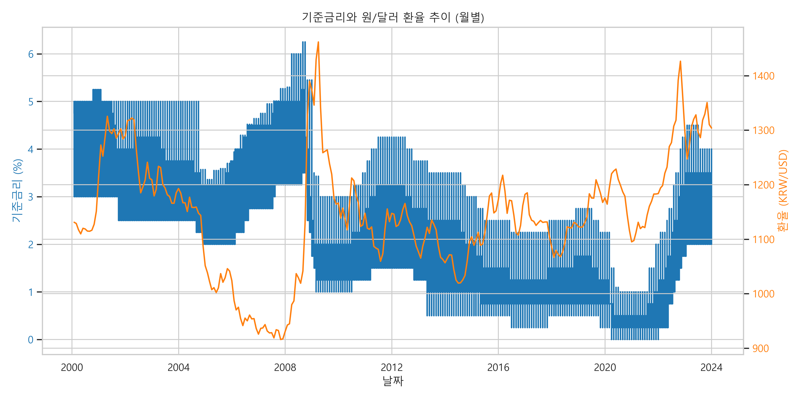
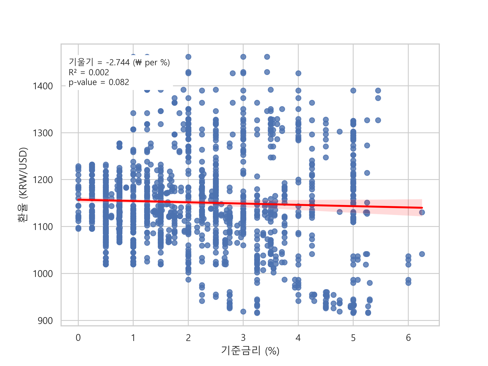
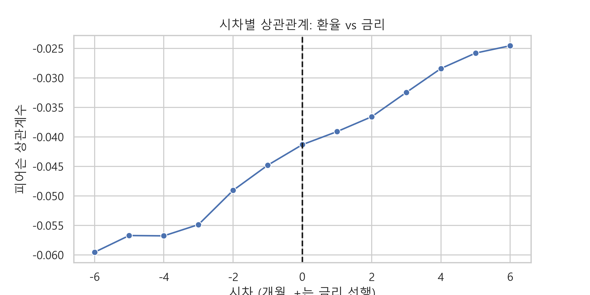

# 📈 Economic Indicators Data Pipeline

한국은행 ECOS API를 활용하여 **기준금리와 원/달러 환율**을 수집•저장•분석•시각화한 **End-to-End 데이터 파이프라인**입니다.
API 페이징 처리, 주기(M/D) 정합, 지표 필터링, DB 적재, 재현 가능한 분석 스크립트까지 한 번에 확인할 수 있습니다.

---

## 🎯 목적
- 한국은행 ECOS API로 **경제지표 자동 수집**
- **SQLite**에 적재하여 반복 분석 가능한 단일 소스 구축
- **환율(일별) → 월평균** 변환 및 **월말 기준**으로 금리와 정합
- **상관분석•단순회귀•시차(Lag)**로 1차 관계 탐색
- 결과를 **스크립트 및 이미지 아웃풋**으로 일관되게 재현

---

## 🗒️ 데이터 소스

- **기준금리**: ECOS 코드 `722Y001` (월별, 2000.01~2023.12)
- **환율(원/USD)**: ECOS 코드 `731Y001` 중 **indicator = "원/미국달러(매매기준율)"**
    - 일별 제공 → **월평균(M)**으로 집계, 금리와 월말 타임스탬프 기준 병합

---

## 📁 디렉토리
```
ecoomic-indicators-pipeline/
│
├─ src/
│ ├─ fetch_data.py # ECOS API 호출(자동 분할), 스키마 정리
│ ├─ save_to_db.py # SQLite 저장
│ ├─ analysis.py # 전처리(월평균/월말 정합), 상관·회귀·시차 분석, 시각화
│ ├─ main.py # 수집 → 저장 파이프라인
│ └─ config.py # API_KEY, BASE_URL, DB_PATH
│
├─ data/
│ └─ economic.db # SQLite DB (자동 생성/갱신)
│
├─ time_series.png
├─ scatter_regression.png
├─ lag_correlation.png
└─ README.md
```
---

## ⚙️ 실행 방법

1) 저장소 클론
```bash
git clone https://github.com/namho2000/economic-indicators-pipeline.git
cd economic-indicators-pipeline/src
```

2) 패키지 설치
```bash
pip install -r ../requirements.txt
```

3) config.py 설정
```python
API_KEY = "YOUR_ECOS_API_KEY"
BASE_URL = "https://ecos.bok.or.kr/api/StatisticSearch"
DB_PATH = "../data/economic.db"
```

4) 데이터 수집/삭제
```bash
python main.py
```

5) 분석/시각화
```bash
python analysis.py
```
실행 후 저장소 루트에 `time_series.png`, `scatter_regression.png`, `lag_correlation.png`가 생성됩니다.

## 🪄 설계 포인트
- 안정적 수집: ECOS 응답 상한 고려 → `start-end` 자동 분할 호출로 전 기간 수집
- **정합(Granularity)**: 환율(D) 월평균 → 금리(M)와 **월말(timestamp='M')** 기준 병합
- 지표 경제: `731Y001` 내 **"원/미국달러(매매기준율)"**만 필터링(타 통화 혼입 방지)
- 저장 전략: SQLite 경량 저장, 테이블 단위 재생성(`if_exists="replace"`)로 일관성 유지
- 가독성 시각화: 금리(계단형/step) vs 환율(line) 이중축, 산점도+회귀선, 시차 상관 라인

## 📊 결과 요약
- 표본: 2000.01~2023.12 (월별 병합 후 1773행)
- 상관: r ≈ **-0.041**, p ≈ 0.082 (유의하지 않음)
- 단순 회귀: R² ≈ **0.0017** (설명력 미미)
- 시차(±6개월): 전 구간에서 상관선 미약
해석: **기준금리 단일 지표만으로 원/달러 환율을 설명하기는 어렵다.**
환율은 글로벌 달러 사이클, 무역/경상수지, 위험선호, 정책 등 다변수 영향을 크게 받음.

## 📈 시각화

### 1) 기준금리 vs 환율 (월별 추이)


### 2) 기준금리 - 환율 산점도 + 단순회귀


### 3) 시차(Lag) 상관 분석


## ✅ 품질 체크리스트
- *[x] `exchange_rate.indicator`에 **"원/미국달러(매매기준율)"**만 존재
- *[x] 환율 월평균 값이 현실 범위 (예: 800~2000 KRW/USD) 내
- *[x] 금리/환율 월말 기준 병합 확인
- *[x] 기간 월 수 대비 행 개수 합리적(결측 구간 제외 가능)

## 📢 확장 로드맵
- 한•미 금리차(한국 722Y001 vs 미국 정책금리)와 환율 관계 분석
- CPI, 무역수지, 외환보유액, KOSPI 등 외생 변수 추가 → 다변량/VAR
- 예측 모델: ARIMA, VAR, Prophet, LSTM 등 비교
- 스케줄링/자동화: Airflow로 정기 수집